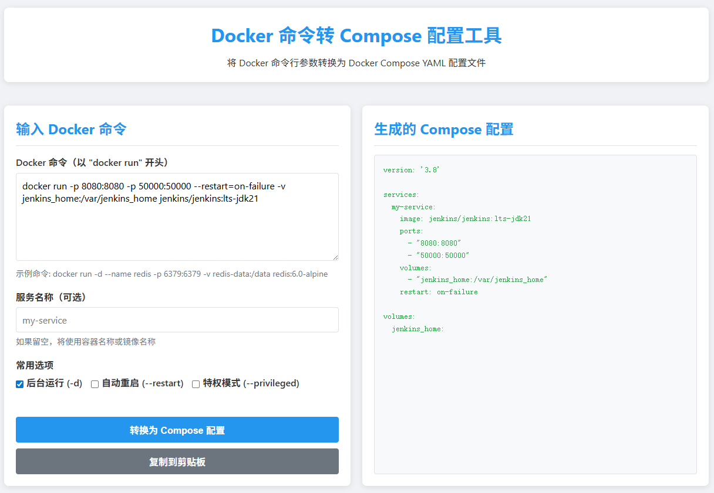

# Docker Command to Compose Converter

这是一个纯前端工具，用于将复杂的 `docker run` 命令转换为 `docker-compose.yml` 配置文件。

## 截图



## 功能特性

- ⚡ **即时转换**: 在浏览器中直接运行，无需后端服务。
- 🛠 **全面支持**:
  - 基础参数: `--name`, `-p/--publish`, `-v/--volume`, `-e/--env`
  - 高级选项: `--network`, `--restart`, `--privileged`
  - 扩展支持: `--hostname`, `--workdir`, `--label`, `--log-opt`
- 📝 **格式兼容**:
  - 支持空格分隔 (`--volume /path`)
  - 支持等号连接 (`--volume=/path`)
  - 智能处理多行命令中的反斜杠 (`\`)
- 📋 **一键复制**: 方便地将生成的 YAML 复制到剪贴板。

## 使用方法

1. 下载本项目或直接打开 [index.html](index.html) 文件。
2. 将你的 `docker run` 命令粘贴到输入框中。
3. 点击 "转换为 Compose 配置" 按钮。
4. 在右侧面板查看或复制生成的 YAML 内容。

## 示例

输入:
```bash
docker run -d --name webui \
  --volume=/data:/app/data \
  -p 8080:80 \
  --restart=always \
  nginx:alpine
```

输出:
```yaml
version: '3.8'

services:
  my-service:
    image: nginx:alpine
    container_name: webui
    ports:
      - "8080:80"
    volumes:
      - "/data:/app/data"
    restart: always
```

## 许可证

本项目基于 MIT 许可证开源。详见 [LICENSE](LICENSE) 文件。
